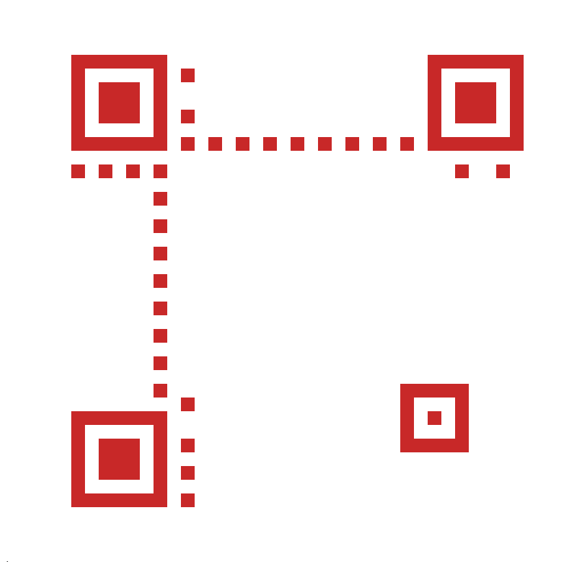

# QR CODE GENERATOR

<p style='color:red'>WORK IN PROGRESS</p>

### USAGE:
#### generate code:
```
qr = QR_code(input_str, 'M')
```
#### display info about qr code:
```
qr.show_complex_info()
qr.show_basic_info()
```

#### store info about qr code in json:
```
simple_json = qr.simple_info
complex_json = qr.complex_info
```
#### save qr code to bmp file:
```
qr.SaveToFile("output.bmp", 20, 2835, (200, 40, 40, 255), (255, 255, 255, 255))
```

## how QR code generation works:
### FINDER PATTERNS:

 The finder pattern consists of an outer black square that is 7 modules by 7 modules, an inner white square that is 5 modules by 5 modules, and a solid black square in the center that is 3 modules by 3 modules. 


### ALIGMENT PATTERN:
QR codes that are version 2 and larger are required to have alignment patterns. An alignment pattern, shown below, consists of a 5 module by 5 module black square, an inner 3 module by 3 module white square, and a single black module in the center. 


### TIMING PATTERNS:
The timing patterns are two lines, one horizontal and one vertical, of alternating dark and light modules


### FORMAT INFORMATION:
The final step to creating a QR Code is to create the format and version strings, then place them in the correct locations in the QR code



### DATA MASKING:

A mask pattern changes which modules are dark and which are light according to a particular rule. The purpose of this step is to modify the QR code to make it as easy for a QR code reader to scan as possible. 


</br>


### FINAL QR CODE:

